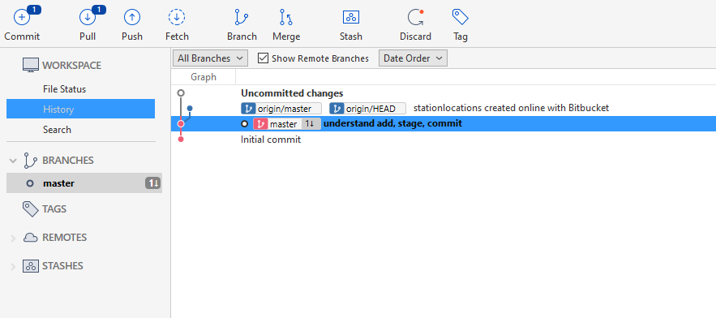
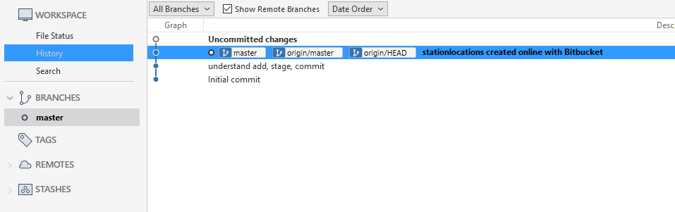
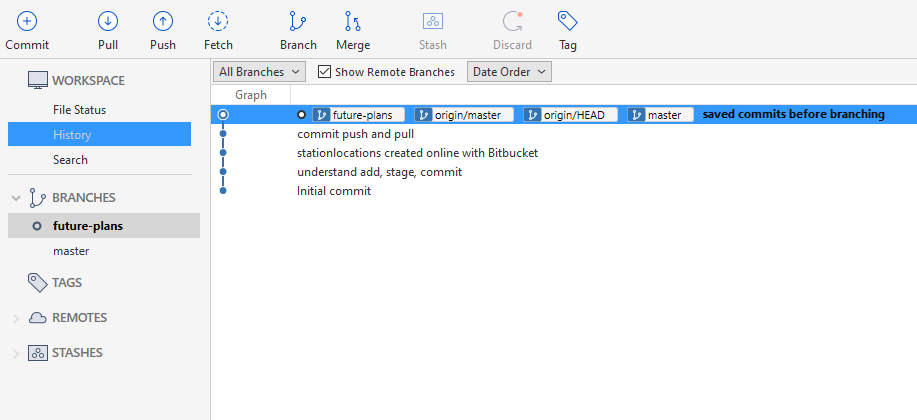
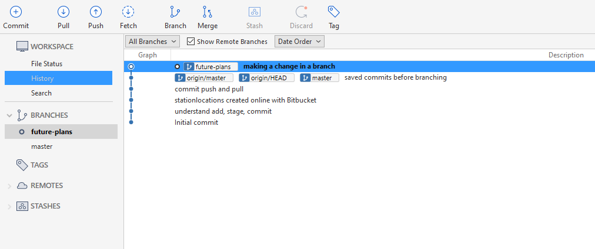
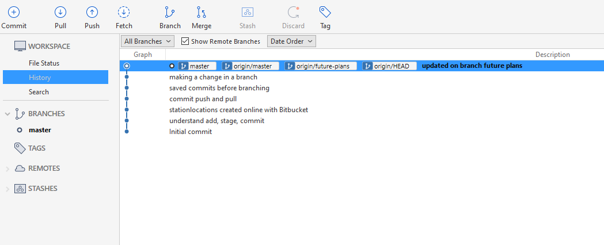

## Learn Git with Bitbucket Cloud

[tutorial link](https://www.atlassian.com/git/tutorials/learn-git-with-bitbucket-cloud)

### Create a Git repository

As our new Bitbucket space station administrator, you need to be organized. When you make files for your space station, you’ll want to keep them in one place and shareable with teammates, no matter where they are in the universe. With Bitbucket, that means adding everything to a repository. Let’s create one!

- You have access to all files in your local repository, whether you are working on one file or multiple files.
- You can view public repositories without a Bitbucket account if you have the URL for that repository.
- Each repository belongs to a user account or a team. In the case of a user account, that user owns the repository. + In the case of a team, that team owns it.
- The repository owner is the only person who can delete the repository. If the repository belongs to a team, an admin can delete the repository.
- A code project can consist of multiple repositories across multiple accounts but can also be a single repository from a single account.
- Each repository has a 2 GB size limit, but we recommend keeping your repository no larger than 1 GB.

#### Step 1. Create the repository

Initially, the repository you create in Bitbucket is going to be empty without any code in it. That's okay because you will start adding some files to it soon. This Bitbucket repository will be the central repository for your files, which means that others can access that repository if you give them permission. After creating a repository, you'll copy a version to your local system—that way you can update it from one repo, then transfer those changes to the other.


### Copy your Git repository and add files

Now that you have a place to add and share your space station files, you need a way to get to it from your local system. To set that up, you want to copy the Bitbucket repository to your system. Git refers to copying a repository as "cloning" it. When you clone a repository, you create a connection between the Bitbucket server (which Git knows as origin) and your local system.

#### Step 1. Clone your repository to your local system

We already know how to do this...


#### Step 2. Add a file to your local repository and put it on Bitbucket

With the repository on your local system, it's time to get to work. You want to start keeping track of all your space station locations. To do so, let's create a file about all your locations.

1. Go to your terminal window and navigate to the top level of your local repository.
`$ cd ~/repos/bitbucketstationlocations/`

2. Enter the following line into your terminal window to create a new file with content.
`$ echo "Earth's Moon" >> locations.txt`

3. Get the status of your local repository. The `git status` command tells you about how your project is progressing in comparison to your Bitbucket repository.
At this point, Git is aware that you created a new file, and you'll see something like this:
```
$ git status
On branch master
Your branch is up to date with 'origin/master'.

Changes not staged for commit:
  (use "git add <file>..." to update what will be committed)
  (use "git restore <file>..." to discard changes in working directory)
        modified:   README.md

Untracked files:
  (use "git add <file>..." to include in what will be committed)
        locations.txt

no changes added to commit (use "git add" and/or "git commit -a")
```
The file is untracked, meaning that Git sees a file not part of a previous commit. The status output also shows you the next step: adding the file.

4. Tell Git to track your new locations.txt file using the `git add` command. Just like when you created a file, the git add command doesn't return anything when you enter it correctly.
`$ git add locations.txt`
The git add command moves changes from the working directory to the Git staging area. The staging area is where you prepare a snapshot of a set of changes before committing them to the official history.


5. Check the status of the file.
```
$ git status
On branch master
Your branch is up to date with 'origin/master'.

Changes to be committed:
  (use "git restore --staged <file>..." to unstage)
        new file:   locations.txt

Changes not staged for commit:
  (use "git add <file>..." to update what will be committed)
  (use "git restore <file>..." to discard changes in working directory)
        modified:   README.md
```
Now you can see the new file has been added (staged) and you can commit it when you are ready. The git status command displays the state of the working directory and the staged snapshot.

6. Issue the `git commit` command with a commit message, as shown on the next line. The -m indicates that a commit message follows. 
**The git commit takes the staged snapshot and commits it to the project history. Combined with git add, this process defines the basic workflow for all Git users.**
Up until this point, everything you have done is on your local system and invisible to your Bitbucket repository until you push those changes.
- Git's ability to communicate with remote repositories (in your case, Bitbucket is the remote repository) is the foundation of every Git-based collaboration workflow.

- Git's collaboration model gives every developer their own copy of the repository, complete with its own local history and branch structure. Users typically need to share a series of commits rather than a single changeset. Instead of committing a changeset from a working copy to the central repository, Git lets you share entire branches between repositories.


7. Go back to your local terminal window and send your committed changes to Bitbucket using `git push origin master`. This command specifies that you are **pushing to the master branch (the branch on Bitbucket) on origin (the Bitbucket server).**
Your commits are now on the remote repository (origin).


8. Go to your BitbucketStationLocations repository on Bitbucket.

9. If you click Commits in the sidebar, you'll see a single commit on your repository. Bitbucket combines all the things you just did into that commit and shows it to you. You can see that the Author column shows the value you used when you configured the Git global file ( ~/.gitconfig).
If you click Source in the sidebar, you'll see that you have a single source file in your repository, the locations.txt file you just added.

### Pull changes from your Git repository on Bitbucket Cloud

Next on your list of space station administrator activities, you need a file with more details about your locations. Since you don't have many locations at the moment, you are going to add them right from Bitbucket.

#### Step 1. Create a file in Bitbucket


We go to online bitbucket and create a new file, add in some HTML code and commit the changes
- pretty straightforward

You now have a new file in Bitbucket! You are taken to a page with details of the commit, where you can see the change you just made:

#### Step 2. Pull changes from a remote repository

Now we need to get that new file into your local repository. The process is pretty straight forward, basically just the reverse of the push you used to get the locations.txt file into Bitbucket.

To pull the file into your local repository, do the following:

The git pull command merges the file from your remote repository (Bitbucket) into your local repository with a single command.

When we do `git status` it shows:

```
Your branch is behind 'origin/master' by 1 commit, and can be fast-forwarded.
  (use "git pull" to update your local branch)
```

Also, in `SourceTree` when we `fetch` we get the following information:



Here we can see quite clearly that my local copy of the branch master is behind
`origin/master` by 1 commit

According to the tutorial:
Enter the git `pull --all command` to pull all the changes from Bitbucket. (In more complex branching workflows, pulling and merging all changes might not be appropriate .) Enter your Bitbucket password when asked for it.

In SourceTree simply Pull works fine



Now we can see that, after pulling the local master branch and remote master branch
are at the same level


The git pull command merges the file from your remote repository (Bitbucket) into your local repository with a single command.


Fantastic! With the addition of the two files about your space station location, you have performed the basic Git workflow (clone, add, commit, push, and pull) between Bitbucket and your local system.

### Use a Git branch to merge a file

Being a space station administrator comes with certain responsibilities. Sometimes you’ll need to keep information locked down, especially when mapping out new locations in the solar system. Learning branches will allow you to update your files and only share the information when you're ready.

---

#### What is a branch? What is a fork?

Branching and forking provide two ways of diverging from the main code line. Both Mercurial and Git have the concept of branches at the local level. A repository code branch, like a branch of a tree, remains part of the original repository. The code that is branched (main trunk) and the branch know and rely on each other. Like a tree trunk's branch, a code branch knows about the trunk (original code base) it originated from.

Fork is another way of saying clone or copy. The term fork (in programming) derives from an Unix system call that creates a copy of an existing process. So, unlike a branch, a fork is independent from the original repository. If the original repository is deleted, the fork remains. If you fork a repository, you get that repository and all of its branches.


---

Branches are most powerful when you're working on a team. You can work on your own part of a project from your own branch, pull updates from Bitbucket, and then merge all your work into the main branch when it's ready.

A branch represents an independent line of development for your repository. Think of it as a brand-new working directory, staging area, and project history. Before you create any new branches, you automatically start out with the main branch (called master ). For a visual example, this diagram shows the master branch and the other branch with a bug fix update.


#### Step 1. Create a branch and make a change

Create a branch where you can add future plans for the space station that you aren't ready to commit. When you are ready to make those plans known to all, you can merge the changes into your Bitbucket repository and then delete the no-longer-needed branch.

It's important to understand that branches are just pointers to commits. When you create a branch, all Git needs to do is create a new pointer—it doesn’t create a whole new set of files or folders. Before you begin, your repository looks like this:


To create a branch, do the following:

1. Go to your terminal window and navigate to the top level of your local repository

2. Create a branch from your terminal window.
`$ git branch future-plans`

3. This command creates a branch but does not switch you to that branch, so your repository looks something like this:

The repository history remains unchanged. All you get is a new pointer to the current branch. To begin working on the new branch, you have to check out the branch you want to use.

4. Checkout the new branch you just created to start using it.
`git checkout future-plans`
The git checkout command works hand-in-hand with git branch . Because you are creating a branch to work on something new, every time you create a new branch (with git branch), you want to make sure to check it out (with git checkout) if you're going to use it. Now that you’ve checked out the new branch, your Git workflow looks something like this

In SourceTree we can see the current branch on the left sidebar under Branches


5. Open the stationlocations file using a text editor.

6. Make a change to the file by adding another station location:

7. Save and close the file.

8. Enter git status in the terminal window. You will see something like this:
```
$ git status
On branch future-plans
Changes not staged for commit:
  (use "git add <file>..." to update what will be committed)
  (use "git restore <file>..." to discard changes in working directory)
        modified:   README.md
        modified:   stationlocations

Untracked files:
  (use "git add <file>..." to include in what will be committed)
        diag3.png

no changes added to commit (use "git add" and/or "git commit -a")
```
Notice the On branch future-plans line? If you entered git status previously, the line was on branch master because you only had the one master branch. Before you stage or commit a change, always check this line to make sure the branch where you want to add the change is checked out.

9. Stage your file.
`$ git add stationlocations`

10. Enter the git commit command in the terminal window, as shown with the following:
`$ git commit stationlocations -m 'making a change in a branch'`
With this recent commit, your repository looks something like this:

This is reflected in SourceTree as well:


Now it's time to merge the change that you just made back into the master branch.

#### Step 2. Merge your branch: fast-forward merging

Your space station is growing, and it's time for the opening ceremony of your Mars location. Now that your future plans are becoming a reality, you can merge your future-plans branch into the main branch on your local system.

Because you created only one branch and made one change, use the fast-forward branch method to merge. You can do a fast-forward merge because you have a linear path from the current branch tip to the target branch. Instead of “actually” merging the branches, all Git has to do to integrate the histories is move (i.e., “fast-forward”) the current branch tip up to the target branch tip. This effectively combines the histories, since all of the commits reachable from the target branch are now available through the current one.


To complete a fast-forward merge do the following:

1. Go to your terminal window and navigate to the top level of your local repository.

2. Enter the git status command to be sure you have all your changes committed and find out what branch you have checked out.

3. Switch to the master branch.
`$ git checkout master`

4. Merge changes from the future-plans branch into the master branch. It will look something like this: `$ git merge future-plans`
You've essentially moved the pointer for the master branch forward to the current head and your repository looks something like the fast forward merge above.

5. Because you don't plan on using future-plans anymore, you can delete the branch.
`$ git branch -d future-plans`
After deleting:

When you delete future-plans, you can still access the branch from master using a commit id. For example, if you want to undo the changes added from future-plans, use the commit id you just received to go back to that branch.

6. Enter git status to see the results of your merge, which show that your local repository is one ahead of your remote repository. It will look something like this:
```
$ git status
On branch master
Your branch is ahead of 'origin/master' by 1 commit.
(use "git push" to publish your local commits)
nothing to commit, working directory clean
```
Note this is befor pushing. In SourceTree we already pushed, so all the branches
are at the same level

Here's what you've done so far:

- Created a branch and checked it out
- Made a change in the new branch
- Committed the change to the new branch
- Integrated that change back into the main branch
- Deleted the branch you are no longer using.

#### Step 3. Push your change to Bitbucket

When we used merge, we basically merged the changes in our `future-plans` branch into
our `master` branch. You want to make it possible for everyone else to see the location of the new space station. To do so, you can push the current state of your local repository to Bitbucket.

This diagram shows what happens when your local repository has changes that the central repository does not have and you push those changes to Bitbucket.


Here's how to push your change to the remote repository:

1. From the repository directory in your terminal window, enter git push origin master to push the changes. It will result in something like this:
```
$ git push origin master
Counting objects: 3, done.
Delta compression using up to 8 threads.
Compressing objects: 100% (3/3), done.
Writing objects: 100% (3/3), 401 bytes | 0 bytes/s, done.
Total 3 (delta 0), reused 0 (delta 0)
To https://emmap1@bitbucket.org/emmap1/bitbucketstationlocations.git
fcbeeb0..e3b7732 master -> master
```
2. Click Commits and you can see the commit you made on your local system. Notice that the change keeps the same commit id as it had on your local system.
You can also see that the line to the left of the commits list has a straight-forward path and shows no branches. That’s because the future-plans branch never interacted with the remote repository, only the change we created and committed.

3. Click Branches and notice that the page has no record of the branch either.

4. Click Source, and then click the stationlocations file. You can see the last change to the file has the commit id you just pushed.

5. Click the file history list to see the changes committed for this file, which will look similar to the following figure.


>You are done!
